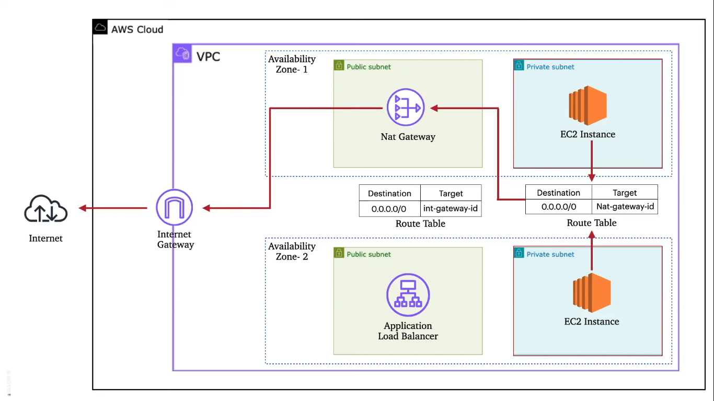

# AWS Infrastructure with Terraform

This project uses Terraform to deploy a web application on AWS. The architecture includes a Virtual Private Cloud (VPC) with public and private subnets, an Application Load Balancer (ALB), two EC2 instances running Nginx, and a Bastion Host for secure access to the private instances.

## Architecture Diagram

  <!-- Update with the actual image path -->

## Project Overview

The Terraform configuration in this project sets up the following resources:

1. **VPC**: A Virtual Private Cloud with a CIDR block that divides the network into public and private subnets.
2. **Subnets**: Two public and two private subnets distributed across different availability zones.
3. **Internet Gateway**: Allows resources in the public subnets to connect to the internet.
4. **NAT Gateway**: Enables instances in the private subnets to access the internet without exposing them to incoming traffic.
5. **Security Groups**: 
    - **ALB Security Group**: Allows HTTP traffic on port 80.
    - **EC2 Security Group**: Allows SSH access from the Bastion Host.
    - **Bastion Host Security Group**: Allows SSH access from a specific IP range.
6. **Application Load Balancer (ALB)**: Distributes incoming HTTP requests across the EC2 instances in the private subnets.
7. **EC2 Instances**: Two instances running Nginx, which are registered to the ALB target group.
8. **Bastion Host**: An EC2 instance in the public subnet used to securely connect to the instances in the private subnets.

## Terraform Code Explanation

- **provider.tf**: Configures the AWS provider with the desired region.
- **vpc.tf**: Defines the VPC, subnets, Internet Gateway, NAT Gateway, and route tables.
- **security_groups.tf**: Sets up security groups for the ALB, EC2 instances, and Bastion Host.
- **alb.tf**: Creates the Application Load Balancer, target group, and listeners.
- **instances.tf**: Provisions the EC2 instances for the web servers and the Bastion Host, including user data scripts to install Nginx and set up SSH keys.
- **variables.tf**: Contains the variables used throughout the Terraform configuration, making the code more flexible and reusable.
- **outputs.tf**: Defines the outputs such as the ALB DNS name, and the private IPs of the EC2 instances.

## Getting Started

1. Clone this repository.
2. Initialize Terraform: `terraform init`
3. Review and apply the configuration: `terraform apply`
4. Access your application via the ALB DNS name provided in the output.

## Diagram References

- **VPC**: A network where the resources are deployed.
- **Subnets**: Public subnets are exposed to the internet, while private subnets are isolated.
- **ALB**: Distributes traffic to the EC2 instances.
- **EC2 Instances**: Run Nginx, serve the web application.
- **Bastion Host**: Bastion Host for Securely access instances in the private subnets.

## Note

The security group rules and IP ranges should be adjusted based on your security requirements. The `allowed_ips` variable in the Terraform configuration should be set to a specific IP range for security purposes.
